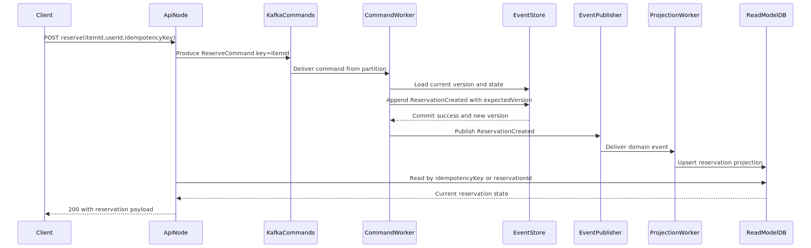

# Distributed Scalable Design

This document captures:

- The current reservation flow and mechanics in this codebase.
- What changes in a distributed (multi-instance) deployment.
- A phased upgrade path to retain no-oversell guarantees.
- A Kafka-partitioned target architecture with operational guidance.

## 1) Current Flow and Mechanics

The current implementation is a strong single-process foundation with event-sourced reservation lifecycle management.

### Core Behavior

- `ReservationAggregate` is the write model and enforces lifecycle invariants:
  - `ACTIVE` can become `CONFIRMED` or `EXPIRED` only.
  - Expired reservations cannot be confirmed.
  - Transition out of `ACTIVE` is one-way.
- `ReserveItemUseCase` does four critical actions under a per-item lock:
  - Expires stale holds inline.
  - Applies idempotency (same user + item active hold).
  - Computes availability as `total - confirmed - active`.
  - Appends `ReservationCreated`.
- `ConfirmReservationUseCase` runs under the same lock boundary:
  - Re-checks expiry.
  - Appends `ReservationConfirmed` (or `ReservationExpired` if stale).
  - Increments confirmed inventory counter.
- `ExpiryWorker` periodically sweeps active reservations and emits `ReservationExpired`.
- `LockManager` provides in-process keyed serialization by `itemId`.

### Current Guarantees

- No oversell under high contention inside a single process.
- Linearizable behavior per item key inside one node.
- Idempotent reserve behavior for active holds.
- Deterministic aggregate transitions from domain events.

### Diagram: Current Single-Process Flow

Source: `docs/diagrams/current-single-process-flow.mmd`

## 2) Distributed Gap Analysis

When scaled to multiple instances, process-local assumptions no longer hold.

### What Breaks Across Nodes

- In-memory keyed lock is local to each process and cannot serialize globally.
- In-memory event store and projection diverge across instances.
- Inventory counters in memory are not globally authoritative.
- Background expiry workers may race and duplicate work.
- Local clocks may drift, affecting timing decisions and auditability.
- Appends have no optimistic concurrency contract (`expectedVersion`), so write-write conflicts are not rejected.

### Resulting Risk

Without distributed coordination and durable state, oversell protection degrades as soon as more than one writer node handles the same `itemId`.

## 3) Distributed Architecture Overview

### Target Principles

- Per-item command ordering is globally consistent.
- Event writes are durable and conflict-safe.
- Read models are asynchronously projected from committed events.
- All state transitions are idempotent and replay-safe.
- Expiry processing is idempotent and shard-aware.

### Diagram: Distributed Architecture Overview

Source: `docs/diagrams/distributed-architecture-overview.mmd`

## 4) Kafka-Partitioned Design

This is the recommended scalable model for this system.

### Partitioning Strategy

- Route reservation commands to `reservation.commands` keyed by `itemId`.
- Kafka guarantees order within each partition; all commands for one `itemId` stay ordered.
- Multiple partitions allow horizontal scaling across many items.
- Consumer group workers process partitions in parallel while preserving per-key order.

### Command Types

- `ReserveCommand(itemId,userId,idempotencyKey,ttlMs,requestedAt)`
- `ConfirmCommand(reservationId,itemId,idempotencyKey,requestedAt)`
- `ExpireCommand(reservationId,itemId,deadlineAt)`

### Write-Side Processing Rules

- One worker instance processes each partition assignment at a time.
- Worker loads stream/version for target reservation aggregate or item ledger.
- Worker applies business rules and appends with optimistic concurrency:
  - `append(streamId, expectedVersion, events)`
- On version conflict, worker retries with bounded backoff and replay.
- Produce committed domain events to `reservation.events`.

### Idempotency and Exactly-Once Effects

- Use API-level idempotency keys persisted in a durable idempotency table.
- Worker checks and stores command outcome atomically with event append transaction.
- Use idempotent Kafka producers and transactional outbox or Kafka transactions to avoid duplicate event publication.
- Projection and expiry handlers must be idempotent:
  - Ignore already-applied event IDs.
  - Apply updates with `upsert` semantics and version guards.

### Retries, DLQ, and Recovery

- Transient failures: retry with exponential backoff.
- Permanent schema/business poison messages: route to `reservation.dlq`.
- DLQ runbook:
  - Inspect payload and error metadata.
  - Apply fix if needed.
  - Replay command/event to source topic with same key.

### Platform Profiles (Kafka Stack Options)

- **AWS MSK**
  - IAM-based auth integration with producer/consumer roles.
  - Use multi-AZ brokers and monitor partition skew via CloudWatch.
  - Pair with RDS/Postgres event store or DynamoDB stream ledger by throughput profile.
- **Confluent Cloud**
  - Managed elastic scaling and cluster-linking for cross-region replication.
  - Use schema registry for command/event evolution and compatibility checks.
  - Prefer transactional producer + exactly-once semantics where cost profile allows.
- **Self-hosted Kafka**
  - Full control over broker tuning, but requires explicit capacity and SRE ownership.
  - Enforce rack-aware placement and tested broker replacement runbooks.
  - Add strong observability for ISR health, under-replicated partitions, and rebalance churn.

### Diagram: Kafka Partition Routing and Ordering

Source: `docs/diagrams/kafka-partition-routing-ordering.mmd`

### Diagram: Distributed Reservation Sequence

Source: `docs/diagrams/distributed-reservation-sequence.mmd`

## 5) Expiry Mechanics in Distributed Mode

### Approach

- Keep expiration decision idempotent and event-driven.
- Trigger expiry via either:
  - Periodic query on read/write store for overdue active holds, or
  - Delayed commands keyed by `itemId` (recommended when available).
- Worker must emit `ReservationExpired` only if current state is still `ACTIVE`.

### Diagram: Expiry State and Idempotence

Source: `docs/diagrams/expiry-state-idempotence.mmd`

## 6) Phased Upgrade Roadmap

### Phase 1: Durability and Concurrency Contract

- Replace in-memory event store with durable store.
- Introduce `expectedVersion` append semantics.
- Add event IDs and command IDs for idempotency.

### Phase 2: Durable Read Models

- Replace in-memory projection with database-backed read model.
- Project events asynchronously with replay support.
- Add projection lag metrics.

### Phase 3: Distributed Command Coordination

- Introduce Kafka `reservation.commands` keyed by `itemId`.
- Move write use cases into partitioned workers.
- Keep APIs stateless and command-driven.

### Phase 4: Expiry at Scale

- Replace local interval sweep with shard-aware expiry processors.
- Ensure expiry is idempotent under retries and rebalances.

### Phase 5: Operability and Reconciliation

- Add invariants dashboards and alerts.
- Implement replay and reconciliation tooling:
  - Rebuild read model from events.
  - Detect and repair projection drift.

## 7) Observability and Runbook Checks

Track the following at minimum:

- Command throughput and end-to-end latency (`p50/p95/p99`).
- Append conflict retry rate by stream and item.
- Partition lag and rebalance frequency.
- Projection lag and DLQ message rate.
- Invariant checks:
  - `active + confirmed <= total` per item.
  - Duplicate confirm events for same reservation should be zero.

If an invariant alert fires:

1. Freeze affected item writes via feature flag or routing block.
2. Inspect recent command/event history for that item key.
3. Recompute expected state from event stream.
4. Repair projection and replay any missed events.
5. Re-enable writes after consistency checks pass.

## 8) Decision Summary

- Keep event-sourced domain model and invariants.
- Move from in-process locking to partitioned command serialization by `itemId`.
- Enforce optimistic concurrency at append boundary.
- Treat projections and expiry as idempotent distributed consumers.
- Operate with explicit retries, DLQ handling, and reconciliation.
